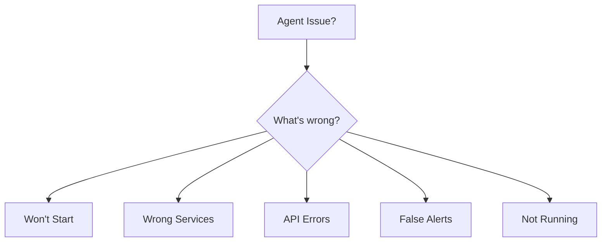

# Kairix SRE Agent - Troubleshooting Decision Tree

## Start Here



## Issue: Agent Won't Start

```bash
# Step 1: Test basic functionality
uv run python -c "print('Python works')"
```
↓ **Fails?** → Install/fix Python environment: `just install`

↓ **Works?** → Continue

```bash
# Step 2: Test configuration
uv run python -c "from sre_agent.config import get_default_config; get_default_config()"
```
↓ **Error: Permission denied** → Fix: `mkdir -p ~/kairix/logs/sre-agent`

↓ **Error: Module not found** → Fix: `uv sync`

↓ **Works?** → Continue

```bash
# Step 3: Test without OpenAI
uv run python test_demo.py
```
↓ **Works?** → OpenAI issue, check API key

↓ **Fails?** → Check error message

## Issue: Wrong/Missing Services

```bash
# Step 1: Check Caddyfile exists
ls -la ~/kairix/caddyfile
```
↓ **Not found?** → Wrong location or missing file

↓ **Exists?** → Continue

```bash
# Step 2: Test parser
uv run python -c "
from sre_agent.caddyfile_parser import CaddyfileParser
p = CaddyfileParser()
services = p.parse_services()
print(f'Found {len(services)} services')
for s in services:
    print(f\"  - {s['username']}: {s['ports']}\")
"
```
↓ **0 services?** → Caddyfile format issue

↓ **Shows services?** → Continue

```bash
# Step 3: Verify configuration
just sre-services
```
↓ **Still wrong?** → Check for parsing edge cases

### Common Caddyfile Issues

1. **Missing basic_auth block**
   ```caddy
   # Bad - no username
   http://xyz.kairix.net {
       handle_path / {
           reverse_proxy localhost:6015
       }
   }
   
   # Good - has basic_auth
   http://xyz.kairix.net {
       basic_auth {
           username $2a$14$...
       }
       handle_path / {
           reverse_proxy localhost:6015
       }
   }
   ```

2. **Non-standard port patterns**
   ```bash
   # Expected ranges:
   # UI: 6000-6999
   # API: 7000-7999
   # Tools: 8000-8999
   ```

## Issue: OpenAI API Errors

```bash
# Step 1: Check key is set
echo $OPENAI_API_KEY | cut -c1-10
```
↓ **Empty?** → Set it: `export OPENAI_API_KEY="sk-..."`

↓ **Shows sk-...?** → Continue

```bash
# Step 2: Test API key
curl -s https://api.openai.com/v1/models \
  -H "Authorization: Bearer $OPENAI_API_KEY" | jq -r '.error.message'
```
↓ **"Invalid API key"** → Wrong key

↓ **"Rate limit"** → Wait or upgrade plan

↓ **No error?** → Key is valid

```bash
# Step 3: Test in agent
OPENAI_API_KEY=$OPENAI_API_KEY uv run python -c "
from openai import OpenAI
client = OpenAI()
print('OpenAI connected successfully')
"
```

## Issue: False Alerts / Incorrect Health Checks

```bash
# Step 1: Manually verify service
curl -v http://localhost:PORT/ENDPOINT
```
↓ **Connection refused?** → Service is actually down

↓ **200 OK?** → False negative, continue

```bash
# Step 2: Check endpoint configuration
just sre-services | grep SERVICE_NAME
```
↓ **Wrong endpoint?** → Update in Caddyfile

↓ **Correct endpoint?** → Continue

```bash
# Step 3: Test health checker directly
uv run python -c "
import asyncio
from sre_agent.health.checker import HealthChecker
from sre_agent.config import get_default_config

async def test():
    config = get_default_config()
    async with HealthChecker(config) as checker:
        result = await checker.check_service_health('SERVICE_NAME', PORT, '/ENDPOINT')
        print(result)

asyncio.run(test())
"
```

## Issue: Cron/Automation Not Working

```bash
# Step 1: Check cron entry
crontab -l | grep kairix
```
↓ **Not found?** → Run: `just install-cron`

↓ **Found?** → Continue

```bash
# Step 2: Test cron command manually
cd /Users/mark/kairix/kairix-sre-agent && /usr/local/bin/uv run python -m sre_agent.main run
```
↓ **Command not found?** → Use full paths

↓ **Permission denied?** → Check file permissions

↓ **Works?** → Continue

```bash
# Step 3: Check cron logs
# macOS
log show --predicate 'process == "cron"' --last 1h | grep kairix

# Linux
grep CRON /var/log/syslog | grep kairix
```

### Fix: Cron Environment Issues
```bash
# Add to crontab (before the job)
PATH=/usr/local/bin:/usr/bin:/bin
SHELL=/bin/bash

# Or use full paths
*/5 * * * * cd /Users/mark/kairix/kairix-sre-agent && /usr/local/bin/uv run /usr/bin/python -m sre_agent.main run
```

## Issue: High Memory/CPU Usage

```bash
# Step 1: Check for zombie processes
ps aux | grep sre_agent | grep -v grep
```
↓ **Multiple processes?** → Kill extras: `pkill -f sre_agent`

```bash
# Step 2: Check database size
ls -lh ~/.kairix/sre-agent.db
```
↓ **Very large (>100MB)?** → Truncate old data:
```sql
sqlite3 ~/.kairix/sre-agent.db "
DELETE FROM runs WHERE timestamp < datetime('now', '-7 days');
DELETE FROM service_events WHERE timestamp < datetime('now', '-7 days');
VACUUM;
"
```

```bash
# Step 3: Check log sizes
du -sh ~/kairix/logs/sre-agent/*
```
↓ **Very large?** → Rotate logs:
```bash
cd ~/kairix/logs/sre-agent/
for f in *.log; do
    mv $f $f.old
    touch $f
done
gzip *.old
```

## Quick Fixes Cheat Sheet

| Symptom | Quick Fix |
|---------|-----------|
| "Permission denied" | `mkdir -p ~/kairix/logs/sre-agent && chmod 755 ~/kairix/logs` |
| "Module not found" | `cd kairix-sre-agent && uv sync` |
| "Invalid API key" | `export OPENAI_API_KEY="sk-..."` |
| "Database locked" | `rm ~/.kairix/sre-agent.db-journal` |
| "No such file: caddyfile" | Check path: `ls ~/kairix/caddyfile` |
| "Connection refused" | Service down - start it manually |
| Cron not running | `just install-cron` |
| Too many alerts | Increase check interval in cron |

## Still Stuck?

1. **Enable debug logging**
   ```bash
   just sre-debug 2>&1 | tee debug.log
   ```

2. **Check all components**
   ```bash
   # Run the test demo (no OpenAI needed)
   uv run python test_demo.py
   ```

3. **Reset everything**
   ```bash
   # Warning: Loses history
   rm -rf ~/.kairix/sre-agent.db
   rm -rf ~/kairix/logs/sre-agent/*
   just install
   ```

4. **Get help**
   - Include: `debug.log`
   - Include: `just sre-status` output  
   - Include: Error messages
   - Include: `uv run python -m sre_agent.main --version`

---
*Remember: The agent is designed to fail safely. If it can't run, your services keep running - it just won't monitor them.*